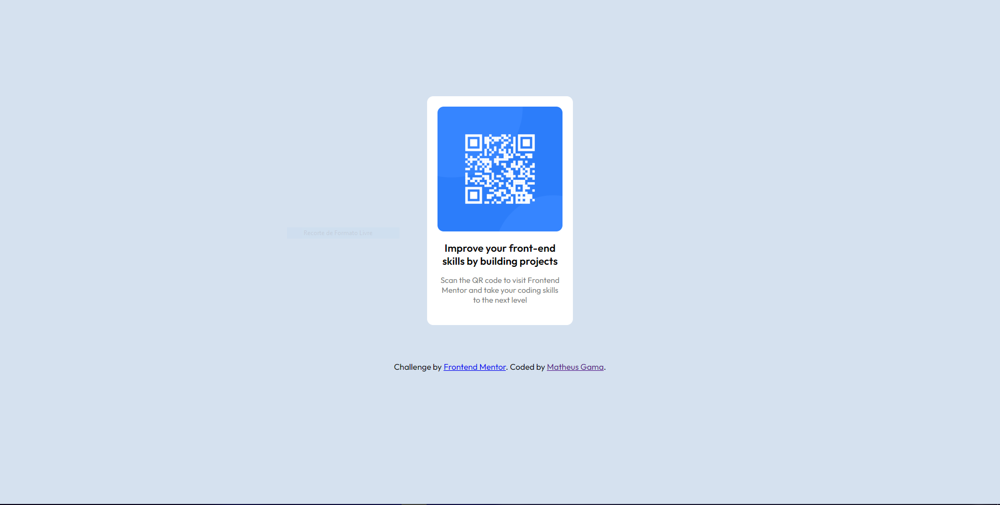

# Frontend Mentor - QR code component solution

This is a solution to the [QR code component challenge on Frontend Mentor](https://www.frontendmentor.io/challenges/qr-code-component-iux_sIO_H). Frontend Mentor challenges help you improve your coding skills by building realistic projects. 

## Infos

- :package: novas funcionalidades
- :up: atualizações 
- :ant: correção de bug
- :checkered_flag: release

## Overview

### Screenshot

## Author

- Website - [Matheus Gama](https://mth-gama.github.io/)
- Frontend Mentor - [@mth-gama](https://www.frontendmentor.io/profile/mth-gama)
- GitHub - [@mth-gama](https://github.com/mth-gama)

## Acknowledgments

Projeto solo
